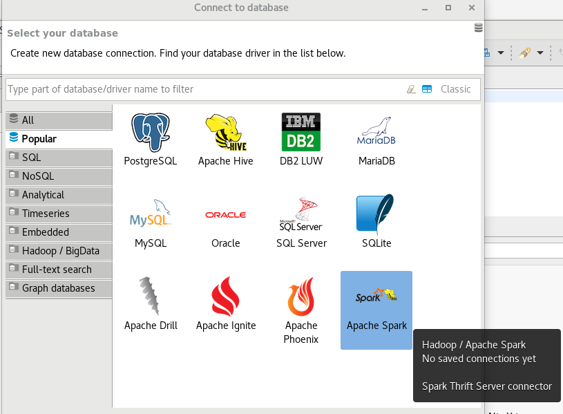
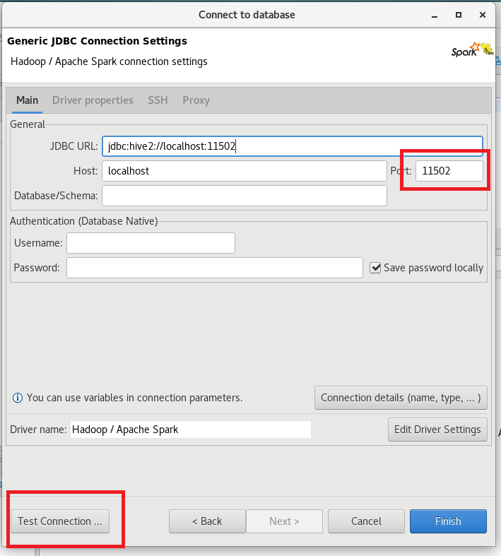
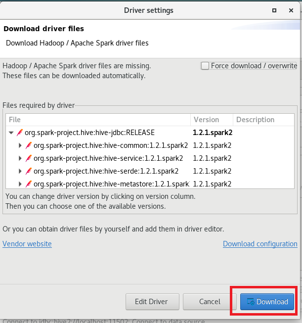
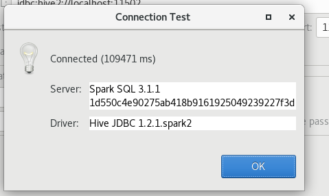
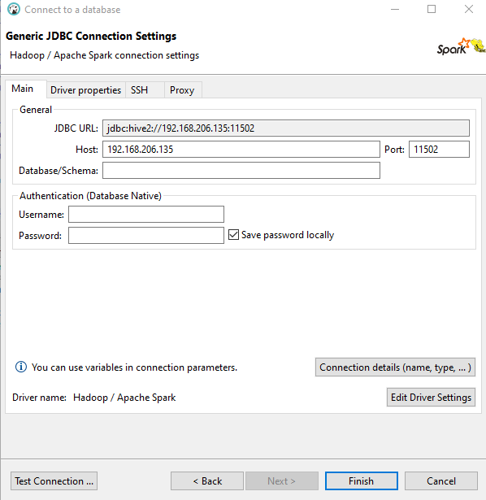
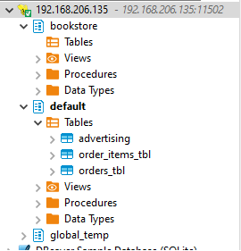

https://spark.apache.org/docs/3.1.1/sql-distributed-sql-engine.html

## 1. Start thrift server
- Hadoop is running
` start-all.sh `

## 2. Resource manager should be empty

## 3. Start thrift server
- vmware
```
start-thriftserver.sh \
  --hiveconf hive.server2.thrift.port=11502 \
  --hiveconf hive.server2.thrift.bind.host=192.168.206.135 \
  --master yarn
```

- virtualbox
```
[train@localhost ~]$ cd /opt/manual/spark/sbin/

[train@localhost sbin]$ ./start-thriftserver.sh \
--hiveconf hive.server2.thrift.port=11502 \
--hiveconf hive.server2.thrift.bind.host=localhost \
--master yarn
```

##  4. Open browser and see the `Thrift JDBC/ODBC Server` is running  

http://localhost:8088/cluster/apps/RUNNING

## 5. Create a connection 



## 6. Test connection 



## 7. Download Drivers






##  8. VMware Deabeaver Connection


It use virtualbox enter localhost or 127.0.0.1 as host


##  9. Explore the hive metadata  



##  10.1. Insert records
```
CREATE TABLE IF NOT EXISTS bookstore.books (id int,
book_name string,
isbn bigint,
book_id bigint,
price float,
price_currency string,
rating_count int,
author_id bigint,
publisher_id bigint);


insert into bookstore.books values(13,"Madam Bovary (Ciltli)",6050948752,489127179,25.115735,"TRY",5,4098249,46868),
(22,"Mai ve Siyah (Eleştirel Basım)",9750523533,492625951,25.349610000000002,"TRY",17,3066057,63217),
(27,"Nutuk",9759914288,9927355,11.48147,"TRY",23,9705003,46868),
(34,"Devlet",9754734263,395307782,27.9994,"TRY",0,8978000,20709);

SELECT * from bookstore.books;
```

## 10.2. Query
```
select * from test1.hotels_parquet  limit 10;

SELECT  TO_DATE(Review_Date, 'M/d/yyyy') AS Review_Date2 FROM test1.hotels_parquet  limit 10;
```

## 11. Check books table from Hive
```
[train@localhost ~]$  beeline -n train -u jdbc:hive2://127.0.0.1:10000

0: jdbc:hive2://127.0.0.1:10000> set hive.server2.logging.operation.level=NONE;

0: jdbc:hive2://127.0.0.1:10000> show databases;
+----------------+
| database_name  |
+----------------+
| bookstore      |
| default        |
+----------------+

0: jdbc:hive2://127.0.0.1:10000> show tables;
+-----------+
| tab_name  |
+-----------+
| books     |
+-----------+
1 row selected (0.096 seconds)

```
## 12. Stop Thrift Server
```
[train@localhost sbin]$ ./stop-thriftserver.sh 
stopping org.apache.spark.sql.hive.thriftserver.HiveThriftServer2
```