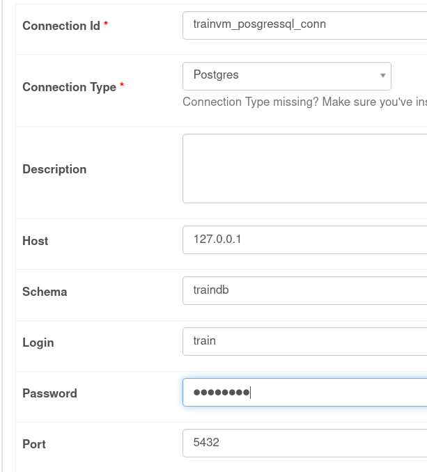

## Creeate a connection


---


---



---


## Create dag file
```commandline
from datetime import datetime, timedelta
from airflow import DAG
from airflow.providers.postgres.operators.postgres import PostgresOperator

start_date = datetime(2022, 10, 11)

default_args = {
    'owner': 'train',
    'start_date': start_date,
    'retries': 1,
    'retry_delay': timedelta(seconds=5)
}

with DAG('sql_operator_dag', default_args=default_args, schedule_interval='*/5 * * * *', catchup=False) as dag:
    t4 = PostgresOperator(task_id='select_books', postgres_conn_id='trainvm_postgresql_con',
                          sql='select * from books;')
```

## See the following from logs
```commandline
 Rows affected: 4
```