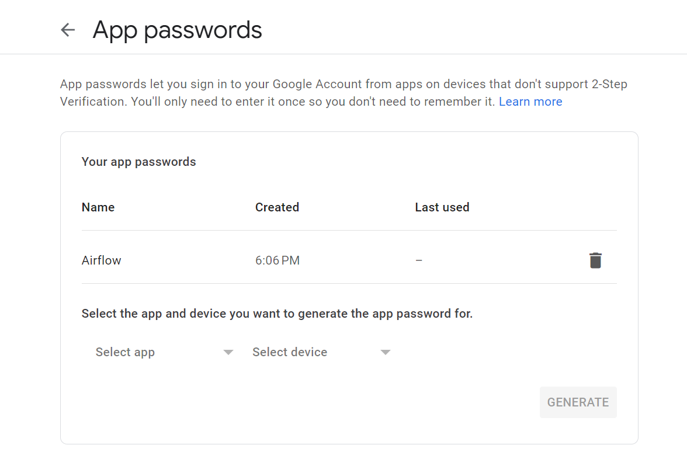
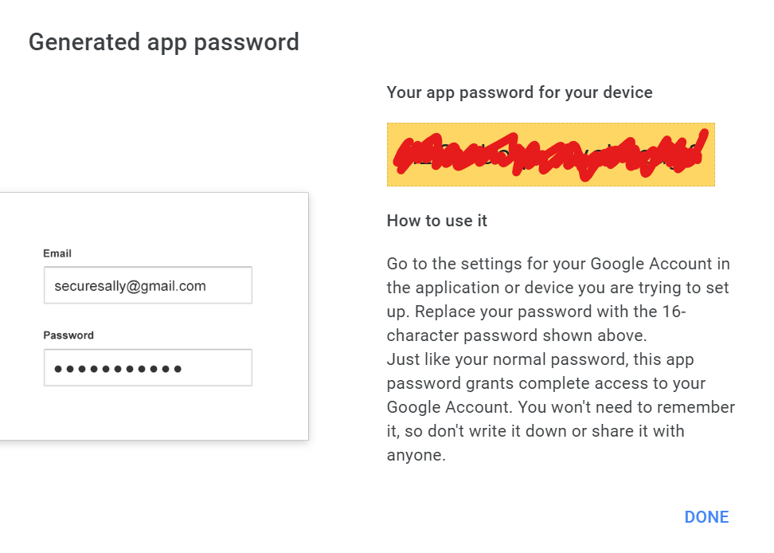
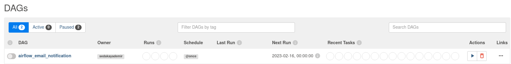
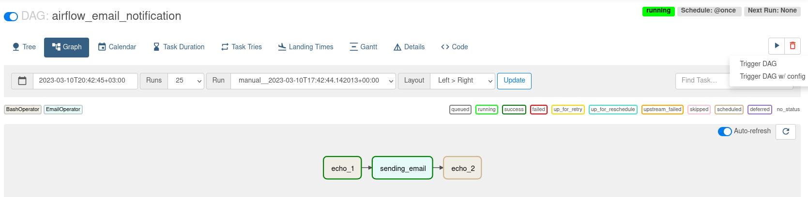
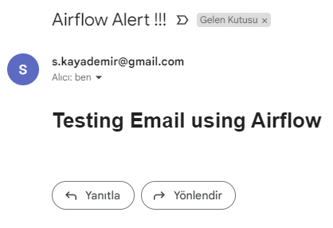

# Airflow Email Notification

First, we need to set up the SMTP configuration to send email from Airflow.

### Step 1: Create App Password for Gmail

Go to this [URL](https://security.google.com/settings/security/apppasswords) and create a new app password.



Copy your app password.



### Step 2: Edit airflow.cfg

```
vi ~/venvairflow/airflow.cfg
```

Find the 'email' and 'smtp' sections in the airflow.cfg file and modify them according to the following example.

```
[email]
email_backend = airflow.utils.email.send_email_smtp

[smtp]
smtp_host = smtp.googlemail.com
smtp_starttls = True
smtp_ssl = False
smtp_user = YOUR_EMAIL_ADDRESS
smtp_password = 16_DIGIT_APP_PASSWORD(app password)
smtp_port = 587
smtp_mail_from = YOUR_EMAIL_ADDRESS
```

- Restart airflow service

```
sudo systemctl restart airflow
sudo systemctl restart airflow-scheduler
```

### Step 3: Create **`09_send_email_dag.py`** file in dags project
```python
from datetime import datetime

from airflow import DAG
from airflow.operators.bash import BashOperator
from airflow.operators.email import EmailOperator

default_args = {
    "owner": "train",
    "start_date": datetime(2023, 3, 10),
    'email_on_failure': True,
}

with DAG(dag_id="airflow_email_notification",
         schedule_interval="@once",
         default_args=default_args,
         ) as dag:


    echo_1 = BashOperator(
        task_id='echo_1',
        bash_command="echo 'Sending email!'"
    )

    sending_email = EmailOperator(
        task_id='sending_email',
        to='any target mail address',
        subject='Airflow Alert !!!',
        html_content="""<h1>Testing Email using Airflow</h1>""",
    )

    echo_2 = BashOperator(
        task_id='echo_2',
        bash_command="echo 'Email sent.'"
    )

echo_1 >> sending_email >> echo_2
```

### Step 4: Copy and Run DAG
```
cp 09_send_email_dag.py ~/venvairflow/dags/
```

Go to [Airflow UI](http://localhost:1502/login/)



Trigger DAG



### Step 5: Check Mailbox



### Resources

[APACHE AIRFLOW: Sending email notifications](https://medium.com/@knoldus/apache-airflow-sending-email-notifications-e357015b72e6)