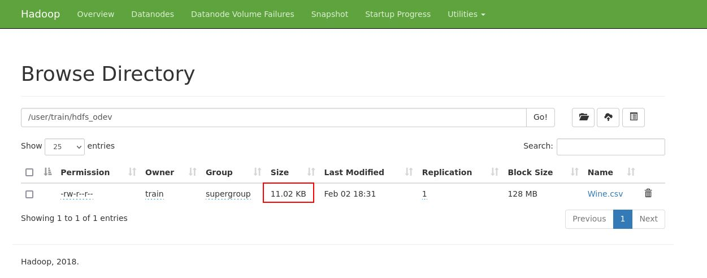

# 1. Hafta HDFS Ödev Çözümleri

## Hadoop Servislerinin Başlatılması

**Komut:**

```
start-all.sh
```

**Beklenen Çıktı:**

```
WARNING: Attempting to start all Apache Hadoop daemons as train in 10 seconds.
WARNING: This is not a recommended production deployment configuration.
WARNING: Use CTRL-C to abort.
Starting namenodes on [localhost]
Starting datanodes
Starting secondary namenodes [trainvm.vbo.local]
WARNING: YARN_CONF_DIR has been replaced by HADOOP_CONF_DIR. Using value of YARN_CONF_DIR.
Starting resourcemanager
WARNING: YARN_CONF_DIR has been replaced by HADOOP_CONF_DIR. Using value of YARN_CONF_DIR.
Starting nodemanagers
WARNING: YARN_CONF_DIR has been replaced by HADOOP_CONF_DIR. Using value of YARN_CONF_DIR.
localhost: WARNING: YARN_CONF_DIR has been replaced by HADOOP_CONF_DIR. Using value of YARN_CONF_DIR.
Hive is starting...
Hive started
```

## Soru 1

> Download and put `https://raw.githubusercontent.com/erkansirin78/datasets/master/Wine.csv` dataset in hdfs `/user/train/hdfs_odev` directory.

## Çözüm 1

### Dosyanın İndirilmesi

**Komut:**

```
wget -P ~/datasets/ https://raw.githubusercontent.com/erkansirin78/datasets/master/Wine.csv
```

**Beklenen Çıktı:**

```
--2023-02-02 18:11:20--  https://raw.githubusercontent.com/erkansirin78/datasets/master/Wine.csv
Resolving raw.githubusercontent.com (raw.githubusercontent.com)... 185.199.108.133, 185.199.110.133, 185.199.111.133, ...
Connecting to raw.githubusercontent.com (raw.githubusercontent.com)|185.199.108.133|:443... connected.
HTTP request sent, awaiting response... 200 OK
Length: 11284 (11K) [text/plain]
Saving to: ‘/home/train/datasets/Wine.csv’

100%[================================================================================================================>] 11,284      --.-K/s   in 0.003s

2023-02-02 18:11:20 (3.43 MB/s) - ‘/home/train/datasets/Wine.csv’ saved [11284/11284]
```

**Komut:**

```
ls -l ~/datasets/
```

**Beklenen Çıktı:**

```
total 28
-rw-rw-r--. 1 train train  4556 Jul 21  2020 Advertising.csv
drwxr-xr-x. 3 train train    96 Nov 19  2020 churn-telecom
-rw-rw-r--. 1 train train  4611 Nov 20  2020 iris.csv
drwxrwxr-x. 2 train train   133 Jul 23  2020 retail_db
-rw-rw-r--. 1 train train 11284 Feb  2 18:11 Wine.csv
```

### HDFS'te İstenen Klasörün Oluşturulması

**Komut:**

```
hdfs dfs -ls /user/train
```

**Beklenen Çıktı:**

```
Found 11 items
drwx------   - train supergroup          0 2021-11-03 22:40 /user/train/.flink
drwxr-xr-x   - train supergroup          0 2023-02-02 00:05 /user/train/.sparkStaging
drwxr-xr-x   - train supergroup          0 2023-02-02 07:50 /user/train/datasets
drwxr-xr-x   - train supergroup          0 2020-11-22 11:04 /user/train/exactly_once_guarantee
drwxr-xr-x   - train supergroup          0 2020-11-22 12:22 /user/train/loans_delta
drwxr-xr-x   - train supergroup          0 2020-11-25 08:35 /user/train/mlflow
drwxr-xr-x   - train supergroup          0 2023-02-01 23:54 /user/train/play-hdfs-commands
drwxr-xr-x   - train supergroup          0 2020-11-20 07:44 /user/train/read_from_kafka
drwxr-xr-x   - train supergroup          0 2020-11-22 13:41 /user/train/saved_models
drwxr-xr-x   - train supergroup          0 2020-11-21 12:53 /user/train/wordCountCheckpoint
drwxr-xr-x   - train supergroup          0 2020-11-22 11:57 /user/train/write_to_kafka
```

**Komut:**

```
hdfs dfs -mkdir /user/train/hdfs_odev
```

**Komut:**

```
hdfs dfs -ls /user/train
```

**Beklenen Çıktı:**

```
Found 12 items
...
drwxr-xr-x   - train supergroup          0 2023-02-02 18:29 /user/train/hdfs_odev
...
```

### HDFS'e Dosyanın Gönderilmesi

**Komut:**

```
hdfs dfs -put ~/datasets/Wine.csv /user/train/hdfs_odev
```


**Komut:**

```
hdfs dfs -ls /user/train/hdfs_odev
```

**Beklenen Çıktı:**

```
Found 1 items
-rw-r--r--   1 train supergroup      11284 2023-02-02 18:31 /user/train/hdfs_odev/Wine.csv
```

## Soru 2

> Copy this hdfs file `/user/train/hdfs_odev/Wine.csv` to `/tmp/hdfs_odev` hdfs directory.

## Çözüm 2

### Klasörün Oluşturulması

**Komut:**

```
hdfs dfs -ls /tmp
```

**Beklenen Çıktı:**

```
Found 4 items
drwx------   - train supergroup          0 2020-09-23 19:48 /tmp/hadoop-yarn
drwx-wx-wx   - train supergroup          0 2020-09-23 18:17 /tmp/hive
drwxr-xr-x   - train supergroup          0 2020-11-25 08:21 /tmp/mlflow
drwxr-xr-x   - train supergroup          0 2020-11-21 12:43 /tmp/temporary-0a4e530a-ab2d-47db-9f7a-a4c79a9d4221
```

**Komut:**

```
hdfs dfs -mkdir /tmp/hdfs_odev
```

**Komut:**

```
hdfs dfs -ls /tmp
```

**Beklenen Çıktı:**

```
Found 5 items
...
drwxr-xr-x   - train supergroup          0 2023-02-02 18:33 /tmp/hdfs_odev
...
```

### Dosyanın Kopyalanması

**Komut:**

```
hdfs dfs -cp /user/train/hdfs_odev/Wine.csv /tmp/hdfs_odev
```

**Komut:**

```
hdfs dfs -ls /tmp/hdfs_odev
```

**Beklenen Çıktı:**

```
Found 1 items
-rw-r--r--   1 train supergroup      11284 2023-02-02 18:34 /tmp/hdfs_odev/Wine.csv
```

## Soru 3

> Delete `/tmp/hdfs_odev` directory with skipping the trash.

## Çözüm 3

**Komut:**

```
hdfs dfs -ls /tmp
```

**Beklenen Çıktı:**

```
Found 5 items
...
drwxr-xr-x   - train supergroup          0 2023-02-02 18:33 /tmp/hdfs_odev
...
```

**Komut:**

```
hdfs dfs -rm -r -skipTrash /tmp/hdfs_odev
```

**Beklenen Çıktı:**

```
Deleted /tmp/hdfs_odev
```

**Komut:**

```
hdfs dfs -ls /tmp
```

**Beklenen Çıktı:**

```
Found 4 items
drwx------   - train supergroup          0 2020-09-23 19:48 /tmp/hadoop-yarn
drwx-wx-wx   - train supergroup          0 2020-09-23 18:17 /tmp/hive
drwxr-xr-x   - train supergroup          0 2020-11-25 08:21 /tmp/mlflow
drwxr-xr-x   - train supergroup          0 2020-11-21 12:43 /tmp/temporary-0a4e530a-ab2d-47db-9f7a-a4c79a9d4221
```

## Soru 4

> Explore `/user/train/hdfs_odev/Wine.csv` file from web hdfs.

## Çözüm 4

- Sanal makinenin arayüzüne giriş yap
- HDFS portalına git
  - http://localhost:9870/explorer.html#/user/train/hdfs_odev


