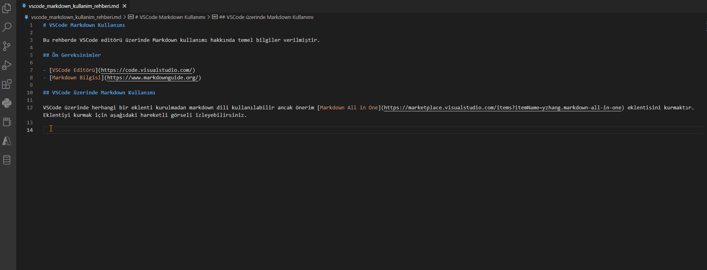
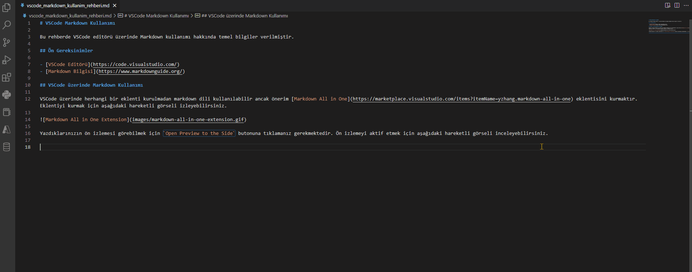

# VSCode Markdown Kullanımı

Bu rehberde VSCode editörü üzerinde Markdown kullanımı hakkında temel bilgiler verilmiştir.

## Ön Gereksinimler

- [VSCode Editörü](https://code.visualstudio.com/)
- [Markdown Bilgisi](https://www.markdownguide.org/)

## VSCode üzerinde Markdown Kullanımı

VSCode üzerinde herhangi bir eklenti kurulmadan markdown dili kullanılabilir ancak önerim [Markdown All in One](https://marketplace.visualstudio.com/items?itemName=yzhang.markdown-all-in-one) eklentisini kurmaktır. Eklentiyi kurmak için aşağıdaki hareketli görseli izleyebilirsiniz.

Yazdıklarınızın ön izlemesi görebilmek için `Open Preview to the Side` butonuna tıklamanız gerekmektedir. Ön izlemeyi aktif etmek için aşağıdaki hareketli görseli inceleyebilirsiniz.

## Bonus: Bir Markdown Dosyasını HTML Dosyası Olarak Kaydetme

Markdown dosyasının bulunduğu dizine HTML formatında kaydetmek için `Ctrl + Shift + P` kombinasyonunu kullanarak açılan komut penceresine `Print current document to HTML` yazmanız yeterlidir. Şu an incelediğiniz bu HTML dosyası bahsedilen yöntemle oluşturulmuştur.

## İnceleyebileceğiniz Dosyalar

- vscode_markdown_kullanim_rehberi.md
- 01_hdfs_answer.md
- 01_hive_basic_answer.md

Bir sorunuz olması durumunda özelden ulaşabilirsiniz. Ayrıca beni aşağıdaki hesaplardan da takip edebilirsiniz. 😊

- Medium: https://cemalcici.medium.com
- Github: https://github.com/cemalcici